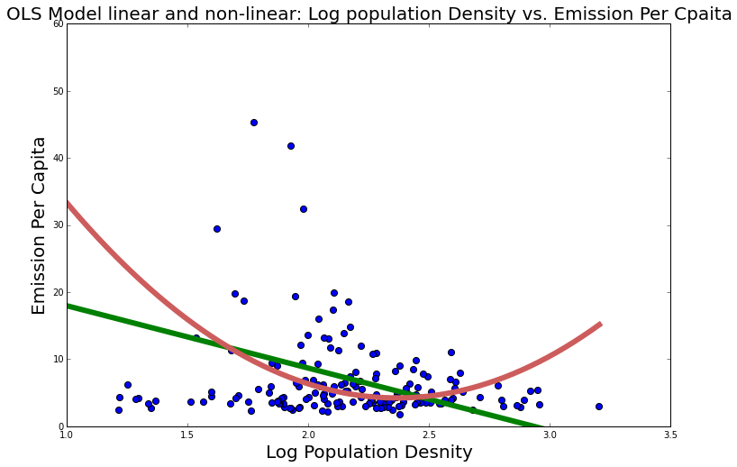

dm3849 - madinghehe
Clarity
The plot is easy to read, and it is clear that the independent variable is building units, and the dependent variable is the energy. Still, it might be better if the axes were more specific in their names and descriptions. Also, the plot is missing a title which would be helpful in quickly knowing what you are looking at, especially since there are three separate plots being shown. 

Aesthetic
The plot is aesthetically pleasing, and laid out and colored in a functional way. Perhaps, however, it would be more clear if the regression line were a different color from the scatter points. Also the points near the center are very heavily clustered and end up looking mushed together. Perhaps adding outlines to each point would make the plot more legible and pretty.

Honesty
The plot is honestly visualizing the data, and there is no clear bias or deformation.

ssp501 - svarmit
Clarity
The plot is very clear and easy to interpret. All of the axes are fully labeled and the plot has a descriptive title. The 3D aspect helps a lot to understand the variables being compared.

Aesthetic
The plot is beautiful. The colors contrast well with each other, and appear to take into account colorblind users. The only minor issue is that the colors for 2011 and for 2007 are somewhat similar, but that does not really matter since they are not next to each other. The isomeric angle view of the plot and the transparency of the bars helps enhance the aesthetics of the plot, while also making it more clear and functional.

Honesty
The plot is honestly visualizing the data, and there is no clear bias or deformation.

yf903 - YiningFan
Clarity
The plot is mostly clear. The axes are labeled and there is also a descriptive title. However, it should be stated explicitly that “emissions” means “carbon emissions,” or else some people might get confused. Also, there are a few typos for the title and the axes. Also, there is no specification about where this data is from. Population density may have varying effects across cities, states, countries, and continents. It should be mentioned what the scale of this data is.

Aesthetic
The aesthetics are not bad, but not great. They could be easily enhanced by using imported matplotlib styles, or using packages such as Seaborn. Also, the colors to not take into account red-green colorblind users. 

Honesty
The plot is trying to honestly visualize the data, however not specifying the scale of the data or mentioning what the data represents is misleading and could be used to emphasize a point.
