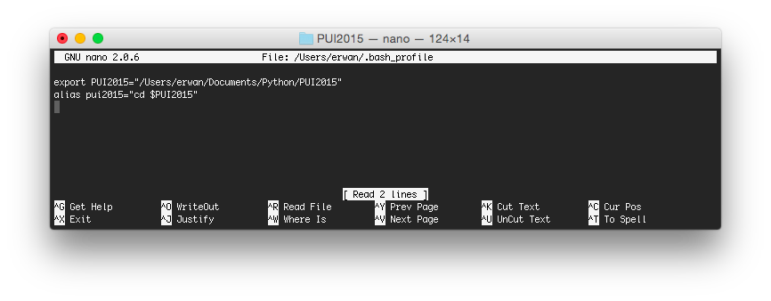

# PUI2015_elecun

To set up my environment, I first created a ~/.bash_profile file in my home directory.

Then, I edited that file to include an environmental variable named 'PUI2015', and an alias named 'pui2015'.

PUI2015 is a pointer to a directory, and pui2015 is a command to set the current working directory to PUI2015.

